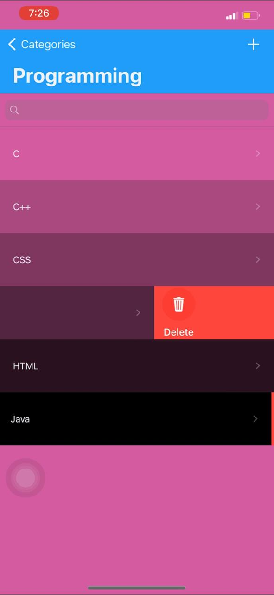
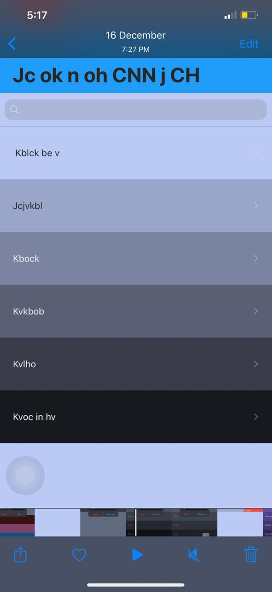
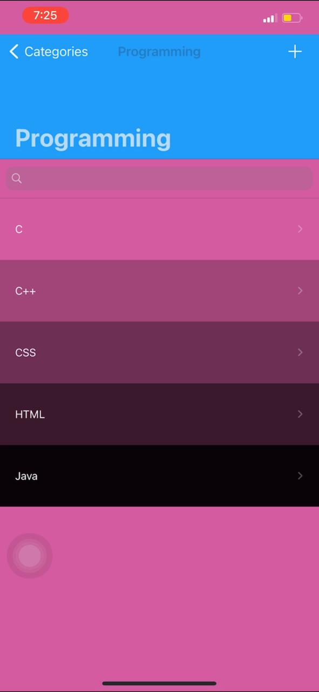
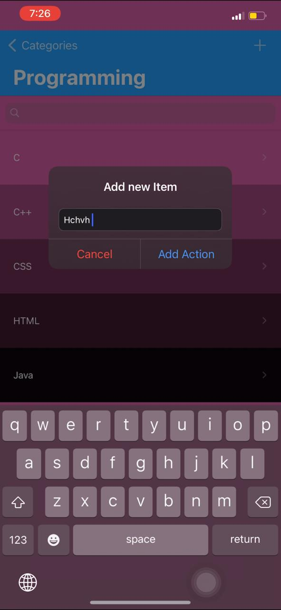
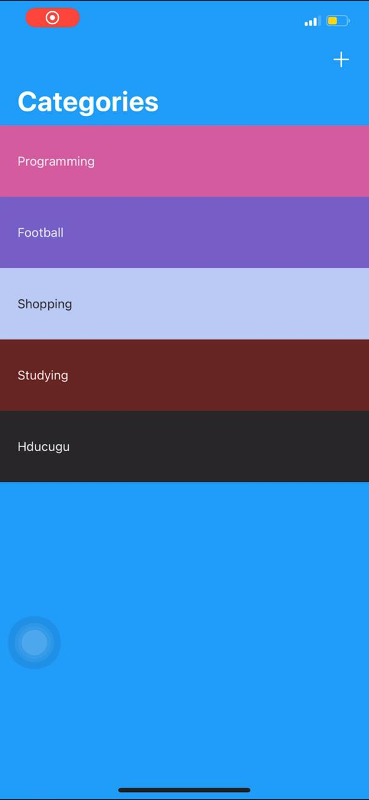

# Note App.

## ToDoListApp like note.

## Created a note app, which has categories and each category has many items and u can add, edit, search, or delete them, and they have color grading using Cocoa-pods and Realm

* Integrated third party libraries in your app using Cocoapods like swipe to delete things.
* Used ChameleonFramework to give me a colorful app.
* Stored data and you can search between things whether (Category/Items) 
* Used a Realm to store things in your phone.

